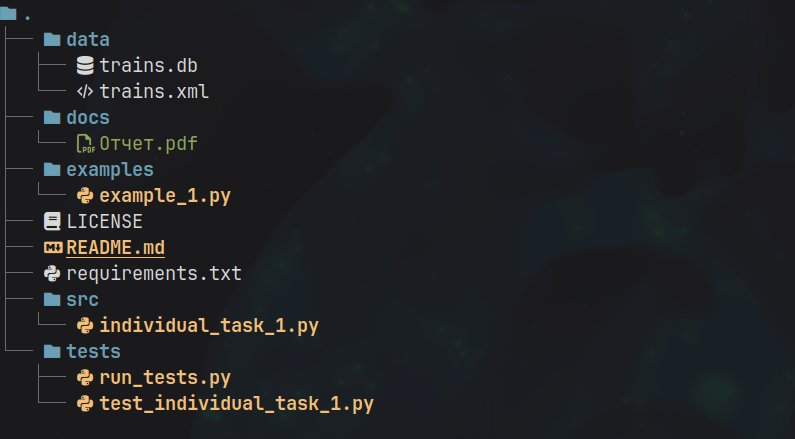

# Лабораторная работа №7 (4.6)
**Предмет** Объектно-ориентированное программирование  
**Тема:** Классы данных в Python.  
**Вариант:** 8  

## Содержание

1. [Описание работы](#цель-работы)  
2. [Ссылка на отчет](#ссылка-на-отчет)  
3. [Структура репозитория](#структура-репозитория)  
4. [Задания](#задания)  

---

## Цель работы

Приобретение навыков по работе с классами данных при написании программ с помощью языка программирования Python версии 3.x.

---

## Ссылка на отчет

[Отчет о выполнении лабораторной работы](docs/Отчет.pdf)

---

## Структура репозитория

- `src/` — исходный код программы  
- `docs/` — отчет по лабораторной работе  
- `pictures/` — вспомогательные изображения
- `tests/` — unit тесты
- `examples/` — примеры из лабораторной работы
- `.pre-commit-config.yaml` — конфигурация pre-commit
- `requirements.txt` — список зависимостей

---

## Задания

### Индивидуальное задание №1  
[Исходный код задания](src/individual_task_1.py)  

Выполнить индивидуальное задание лабораторной работы 4.5, использовав классы данных, а также загрузку и сохранение данных в формат XML.
